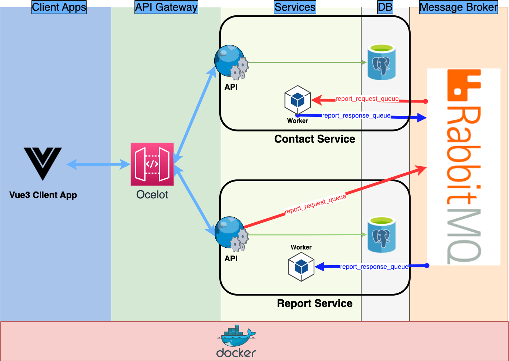

# rise-microservice

# run

docker-compose up -d

# Service Urls

- RabbitMQ: http://localhost:15672
- postgresql: localhost:5432
  - user: postgres, password: rise
- api gateway: http://localhost:5001
- contact service: http://localhost:5005
- report service: http://localhost:5007
- vue3 app: http://localhost:8080